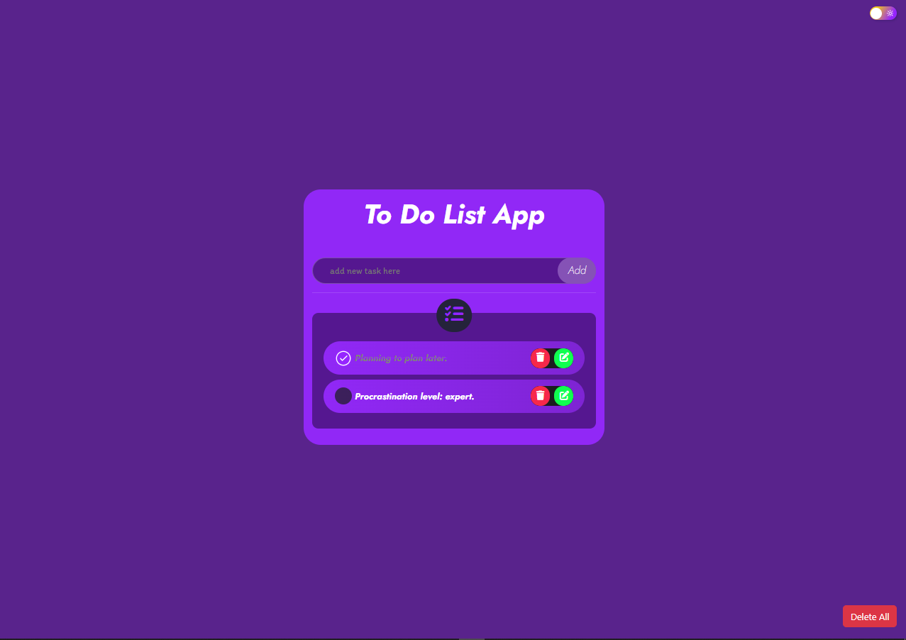

# 📋 Just To Do App :)

A simple and elegant To-Do List application built with responsive design, smooth animations, and full CRUD functionality. This app helps users manage their daily tasks efficiently while supporting both dark and light modes.

---

## ✨ Features

- 🌗 **Dark and Light Mode** – Toggle between light and dark themes for better user comfort.
- 🎯 **Professional Animations & Effects** – Smooth and modern UI interactions.
- 📱 **Responsive Design** – Fully functional across all devices (mobile, tablet, desktop).
- 📝 **CRUD Operations** – Create, Read, Update, and Delete tasks seamlessly.
- 💾 **LocalStorage Integration** – Save tasks locally so data persists across sessions.

---

## 🚀 Technologies Used

- **HTML5**
- **CSS3**
- **JavaScript (Vanilla)**
- **LocalStorage API**

---

## 📚 What I Learned

1. Implementing **CRUD operations** effectively in a web application.
2. Writing **clean and efficient JavaScript and CSS** code for scalability and readability.
3. Using the **LocalStorage API** to store and retrieve data without backend support.
4. Creating a **responsive layout** that adapts to various screen sizes.
5. Designing with **UI/UX best practices** including theme switching and user feedback.

---

## 📸 Screenshots

| ![DarkMode]](./DarkMode.png) |  |

---

Developed by Mohammed
